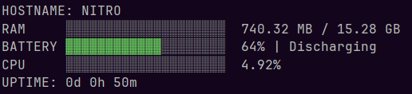

# vitals

`vitals` is a small terminal utility written in C that displays basic Linux system health information.

It shows:

- hostname,
- RAM usage,
- battery level and status,
- CPU usage,
- CPU temperature, if available,
- system uptime.

The output is displayed in the terminal using colored progress bars.

## Example output



## Requirements

This project is intended for Linux systems and reads data from system files such as:

- `/proc/meminfo`
- `/proc/stat`
- `/proc/uptime`
- `/etc/hostname`
- `/sys/class/power_supply/BAT1`
- `/sys/class/thermal/thermal_zone0/temp`

To build the project, you need:

- a C compiler with C11 support,
- CMake 3.28 or newer.

## Building
```plantuml
gcc -o vitals vitals.c main.c visuals.c
```

## Running
After building the project, run:
```plantuml
./vitals
```

## Notes
The program assumes that the battery is available at: text /sys/class/power_supply/BAT1
On some systems, the battery may be available as `BAT0` instead of `BAT1`. In that case, battery information may not be displayed unless the path is changed in the source code.

Temperature reading depends on the availability of: 
/sys/class/thermal/thermal_zone0/temp

If this file does not exist, the temperature will not be displayed.

